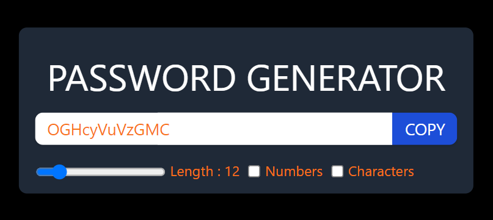

# React Vite Password Generator

This is a simple password generator application built using React and Vite. It allows users to generate random passwords with customizable length and options for including numbers and special characters.

## Image


## Features

- Generates random passwords based on user-defined criteria.
- Allows users to specify the length of the password.
- Option to include numbers and special characters in the generated password.
- Ability to copy the generated password to the clipboard.

## Installation and Usage

1. Clone the repository:

   ```bash
   git clone https://github.com/soubhagya2001/password-generator-react.git

2. Navigate to the project directory:
    ```bash
    cd password-generator-react

3. Install dependencies:
    ```bash
    npm install

4. Start the development server:
    ```bash
    npm run dev

5. Open your browser and visit http://localhost:3000 to use the password generator.

## Usage
* Adjust the length of the password using the range slider.
* Check/uncheck the "Numbers" and "Characters" checkboxes to include/exclude them in the generated password.
* Click the "COPY" button to copy the generated password to the clipboard.

## Technologies Used
* React
* Vite
* Tailwind CSS